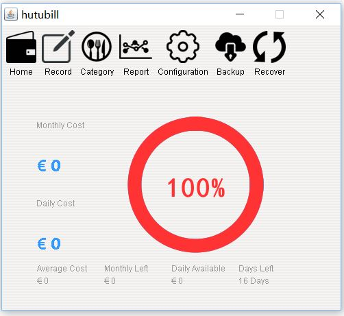
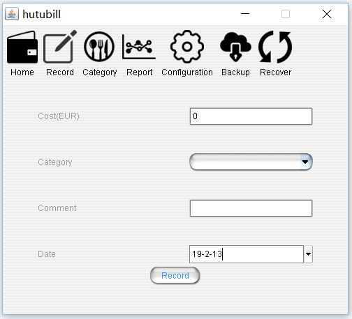
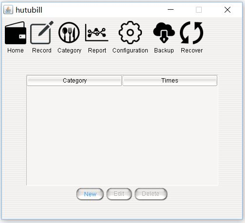
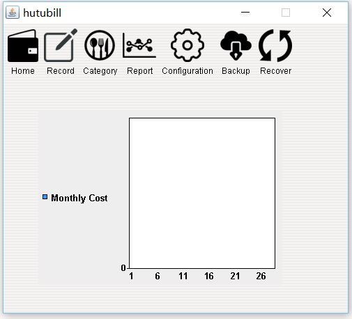
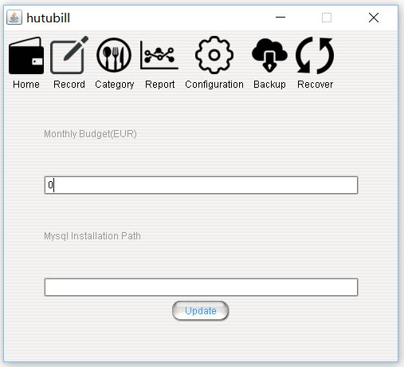
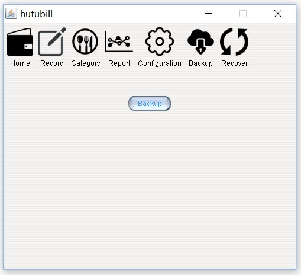
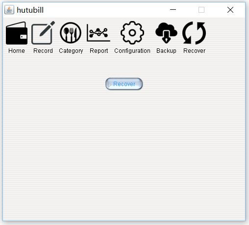

# hutubill
This is a concise JAVA app to organize personal finance, which is based on **Swing** and **JDBC**. Some design patterns are involved, such as **singleton** and **Service-Entity-DAO**, etc. Below are different panel snapshots:

1. **Home** - Overview of financial status

2. **Record** - Record new consumption

3. **Category** - Add new consumption category (eg. shopping, party, etc.)

4. **Report** - Review monthly consumption as chart

5. **Configuration** - Set the budget and MySQL installation path

6. **Backup** - Save current status

7. **Recover** - Recover last saved status

### This project idea comes from practices in a JAVA learning website: [how2j](http://how2j.cn/). 

### Redistribution is NOT allowed!
